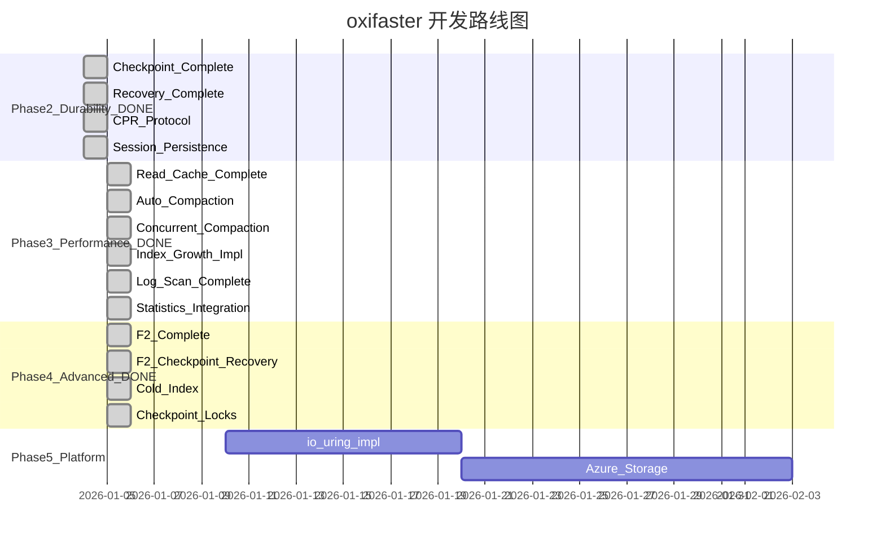

# oxifaster

oxifaster 是微软 [FASTER](https://github.com/microsoft/FASTER) 项目的 Rust 移植版本，提供高性能并发键值存储和日志引擎。

## 特性

- **高性能**: 支持超过内存容量的大规模数据高效读写
- **并发安全**: 基于 Epoch 保护机制的无锁并发控制
- **持久化**: 完整的检查点 (Checkpoint) 和恢复 (Recovery) 支持，含 CPR 协议
- **混合日志**: HybridLog 架构，热数据内存 + 冷数据磁盘
- **异步 I/O**: 基于 Tokio 运行时的异步操作支持
- **Read Cache**: 热点数据内存缓存加速读取，透明集成到读取路径
- **Log Compaction**: 日志压缩与空间回收，支持自动后台压缩
- **Index Growth**: 动态哈希表扩容，支持 rehash 回调确保正确性
- **F2 架构**: 热冷数据分离的两级存储，含完整 Checkpoint/Recovery
- **Statistics**: 完整的统计收集，集成到所有 CRUD 操作

## 快速开始

### 安装

在 `Cargo.toml` 中添加依赖:

```toml
[dependencies]
oxifaster = { path = "oxifaster" }
```

### 基本使用

```rust
use std::sync::Arc;
use oxifaster::device::NullDisk;
use oxifaster::store::{FasterKv, FasterKvConfig};

fn main() {
    // 创建配置
    let config = FasterKvConfig::default();
    
    // 创建存储设备 (使用 NullDisk 进行内存测试)
    let device = NullDisk::new();
    
    // 创建存储
    let store = Arc::new(FasterKv::new(config, device));
    
    // 启动会话
    let mut session = store.start_session();
    
    // 插入数据
    session.upsert(42u64, 100u64);
    
    // 读取数据
    if let Ok(Some(value)) = session.read(&42u64) {
        println!("Value: {}", value);
    }
    
    // 删除数据
    session.delete(&42u64);
}
```

---

## 实现状态与开发路线图

本节详细说明 oxifaster 与原始 C++/C# FASTER 项目的功能对比，以及后续开发计划。

### 架构概览

```
┌─────────────────────────────────────────────────────────────────────┐
│                           Application                                │
├─────────────────────────────────────────────────────────────────────┤
│                     Session / ThreadContext                          │
├──────────────────────────┬──────────────────────────────────────────┤
│       FasterKV           │           FasterLog                       │
├──────────────────────────┼──────────────────────────────────────────┤
│      Read Cache          │         Log Compaction                    │
├──────────────────────────┴──────────────────────────────────────────┤
│                         Epoch Protection                             │
├─────────────────────────────────────────────────────────────────────┤
│    Hash Index    │    Hybrid Log (PersistentMemoryMalloc)           │
│  (MemHashIndex)  │  ┌─────────┬─────────┬─────────────────┐         │
│                  │  │ Mutable │ReadOnly │    On-Disk      │         │
│                  │  │ Region  │ Region  │    Region       │         │
│                  │  └─────────┴─────────┴─────────────────┘         │
├─────────────────────────────────────────────────────────────────────┤
│                      Storage Device Layer                            │
│         (NullDisk / FileSystemDisk / io_uring / Azure)              │
└─────────────────────────────────────────────────────────────────────┘
```

---

## 功能对比表 (Rust vs C++ vs C#)

### 核心功能

| 功能模块 | C++ | C# | Rust | 状态 |
|---------|:---:|:---:|:----:|------|
| **Address System** | Y | Y | Y | 完成 |
| **Epoch Protection** | Y | Y | Y | 完成 |
| **Hash Index** | Y | Y | Y | 完成 |
| **Hash Bucket** | Y | Y | Y | 完成 |
| **Overflow Buckets** | Y | Y | Y | 完成 |
| **Hybrid Log** | Y | Y | Y | 完成 |
| **Page Allocator** | Y | Y | Y | 完成 |
| **Record/RecordInfo** | Y | Y | Y | 完成 |
| **Key/Value Traits** | Y | Y | Y | 完成 |
| **FasterKV (CRUD)** | Y | Y | Y | 完成 |
| **Session** | Y | Y | Y | 完成 |
| **Thread Context** | Y | Y | Y | 完成 |
| **FasterLog** | Y | Y | Y | 完成 |

### 设备层

| 功能 | C++ | C# | Rust | 状态 |
|-----|:---:|:---:|:----:|------|
| **NullDisk** | Y | Y | Y | 完成 |
| **FileSystemDisk** | Y | Y | Y | 完成 |
| **io_uring (Linux)** | Y | - | P | Mock 实现 (API 规范化完成) |
| **IOCP (Windows)** | Y | Y | N | 未实现 |
| **Azure Blob Storage** | Y | Y | N | 未实现 |
| **Tiered Storage** | - | Y | N | 未实现 |
| **Sharded Storage** | - | Y | N | 未实现 |

### 持久化与恢复

| 功能 | C++ | C# | Rust | 状态 |
|-----|:---:|:---:|:----:|------|
| **Index Checkpoint** | Y | Y | Y | 完成 |
| **HybridLog Checkpoint** | Y | Y | Y | 完成 |
| **Full Checkpoint** | Y | Y | Y | 完成 (含 CPR 状态机) |
| **CPR Protocol** | Y | Y | Y | 完成 (完整状态机集成) |
| **Snapshot Files** | Y | Y | Y | 完成 (JSON + bincode) |
| **Session Persistence** | Y | Y | Y | 完成 (GUID + serial_num) |
| **Incremental Checkpoint** | - | Y | N | 未实现 |
| **Delta Log** | - | Y | N | 未实现 |

### 性能优化

| 功能 | C++ | C# | Rust | 状态 |
|-----|:---:|:---:|:----:|------|
| **Read Cache** | Y | - | Y | 完成 (集成到读取路径) |
| **Cache Eviction** | Y | - | Y | 完成 (LRU 淘汰策略) |
| **Log Compaction** | Y | Y | Y | 完成 |
| **Auto Compaction** | Y | Y | Y | 完成 (后台线程) |
| **Concurrent Compaction** | Y | Y | Y | 完成 (多线程页面分发) |
| **Index Growth** | Y | Y | Y | 完成 (含 rehash 回调) |
| **Log Scan Iterator** | Y | Y | Y | 完成 (支持 StorageDevice) |

### 高级功能

| 功能 | C++ | C# | Rust | 状态 |
|-----|:---:|:---:|:----:|------|
| **F2 Architecture** | Y | - | Y | 完成 (含 Checkpoint/Recovery) |
| **Cold Index** | Y | - | Y | 完成 (磁盘二级索引) |
| **Checkpoint Locks** | Y | Y | Y | 完成 (CPR 协议锁保护) |
| **Statistics** | Y | Y | Y | 完成 (集成到所有操作) |
| **Variable Length Records** | - | Y | N | 未实现 |
| **Async API** | Y | Y | P | 部分支持 |

### C# 独有功能

| 功能 | Rust 计划 |
|-----|---------|
| **Remote Client/Server** | P3 - 可选 |
| **Locking Context** | P2 |
| **Generic Allocator** | P3 - 可选 |
| **Blittable/VarLen 分配器** | P2 |

**图例**: Y=完成 | P=部分实现 | N=未实现

---

### 已完成功能 (Phase 1 - Core)

| 模块 | 功能 | 文件 | 状态 |
|------|------|------|:----:|
| **address** | 48位逻辑地址系统 | `src/address.rs` | :white_check_mark: |
| **epoch** | LightEpoch 并发保护框架 | `src/epoch/light_epoch.rs` | :white_check_mark: |
| **index** | MemHashIndex 内存哈希索引 | `src/index/mem_index.rs` | :white_check_mark: |
| **index** | HashBucket 哈希桶 | `src/index/hash_bucket.rs` | :white_check_mark: |
| **index** | HashTable 哈希表 | `src/index/hash_table.rs` | :white_check_mark: |
| **index** | GrowState 索引扩展状态 | `src/index/grow.rs` | :white_check_mark: |
| **allocator** | PersistentMemoryMalloc 混合日志 | `src/allocator/hybrid_log.rs` | :white_check_mark: |
| **allocator** | PageAllocator 页面分配器 | `src/allocator/page_allocator.rs` | :white_check_mark: |
| **device** | StorageDevice trait | `src/device/traits.rs` | :white_check_mark: |
| **device** | NullDisk 内存设备 | `src/device/null_device.rs` | :white_check_mark: |
| **device** | FileSystemDisk 文件设备 | `src/device/file_device.rs` | :white_check_mark: |
| **device** | IoUringDevice Mock 实现 | `src/device/io_uring.rs` | :construction: |
| **store** | FasterKV 核心 (Read/Upsert/RMW/Delete) | `src/store/faster_kv.rs` | :white_check_mark: |
| **store** | Session 会话管理 (含 GUID + serial_num) | `src/store/session.rs` | :white_check_mark: |
| **store** | ThreadContext 线程上下文 | `src/store/contexts.rs` | :white_check_mark: |
| **store** | StateTransitions CPR 状态机 | `src/store/state_transitions.rs` | :white_check_mark: |
| **record** | Record/RecordInfo 记录结构 | `src/record.rs` | :white_check_mark: |
| **record** | Key/Value trait 泛型支持 | `src/record.rs` | :white_check_mark: |
| **log** | FasterLog 基础日志 | `src/log/faster_log.rs` | :white_check_mark: |
| **cache** | ReadCache 读缓存 | `src/cache/read_cache.rs` | :white_check_mark: |
| **cache** | ReadCacheConfig 配置 | `src/cache/config.rs` | :white_check_mark: |
| **compaction** | Compactor 压缩器 | `src/compaction/compact.rs` | :white_check_mark: |
| **compaction** | AutoCompactionWorker | `src/compaction/auto_compact.rs` | :white_check_mark: |
| **compaction** | CompactionConfig 配置 | `src/compaction/compact.rs` | :white_check_mark: |
| **f2** | F2Kv 热冷存储 | `src/f2/store.rs` | :white_check_mark: |
| **f2** | F2Config 配置 | `src/f2/config.rs` | :white_check_mark: |
| **f2** | F2 Checkpoint/Recovery | `src/f2/store.rs` | :white_check_mark: |
| **scan** | LogScanIterator 日志扫描 | `src/scan/log_iterator.rs` | :white_check_mark: |
| **scan** | DoubleBufferedLogIterator | `src/scan/log_iterator.rs` | :white_check_mark: |
| **stats** | StatsCollector 统计收集 | `src/stats/collector.rs` | :white_check_mark: |
| **checkpoint** | Checkpoint 状态结构 | `src/checkpoint/state.rs` | :white_check_mark: |
| **checkpoint** | Recovery 恢复结构 | `src/checkpoint/recovery.rs` | :white_check_mark: |
| **checkpoint** | Serialization 序列化 | `src/checkpoint/serialization.rs` | :white_check_mark: |
| **checkpoint** | Checkpoint Locks CPR 锁 | `src/checkpoint/locks.rs` | :white_check_mark: |
| **index** | Cold Index 磁盘冷索引 | `src/index/cold_index.rs` | :white_check_mark: |
| **compaction** | Concurrent Compaction | `src/compaction/concurrent.rs` | :white_check_mark: |

**图例**: :white_check_mark: 完成 | :construction: 部分完成 | :x: 未实现

---

### 开发路线图 (2026)



### Phase 2: 持久化与恢复 (Durability) - P0 :white_check_mark: 已完成

| 功能 | 描述 | 文件 | 状态 |
|------|------|------|:----:|
| **Checkpoint 元数据序列化** | Index + HybridLog 元数据持久化 | `checkpoint/serialization.rs` | :white_check_mark: |
| **Index Checkpoint** | 哈希索引检查点写入 | `checkpoint/state.rs` | :white_check_mark: |
| **HybridLog Checkpoint** | 混合日志检查点写入 | `checkpoint/state.rs` | :white_check_mark: |
| **Recovery 完整实现** | 从检查点恢复完整状态 (含 RecoveryState) | `checkpoint/recovery.rs` | :white_check_mark: |
| **CPR 协议** | Concurrent Prefix Recovery 完整状态机 | `store/state_transitions.rs` | :white_check_mark: |
| **Session 持久化** | GUID + serial_num 保存与恢复 | `store/session.rs` | :white_check_mark: |
| **Snapshot 文件格式** | 快照文件读写 (JSON + bincode) | `checkpoint/serialization.rs` | :white_check_mark: |

```rust
// 已实现 API
let token = store.checkpoint(checkpoint_dir)?;      // 完整 checkpoint (含 CPR 状态机)
let store = FasterKv::recover(dir, token, config, device)?;  // 恢复 (含 session 状态)

// Session 持久化
let states = store.get_recovered_sessions();        // 获取恢复的 session 状态
let session = store.continue_session(state);        // 从状态恢复 session
```

### Phase 3: 性能优化 (Performance) - P1 :white_check_mark: 已完成

| 功能 | 描述 | 文件 | 状态 |
|------|------|------|:----:|
| **Read Cache 完整集成** | 热点数据内存缓存，集成到读取路径 | `cache/read_cache.rs` | :white_check_mark: |
| **Cache Eviction** | LRU-like 缓存淘汰策略 | `cache/read_cache.rs` | :white_check_mark: |
| **Auto Compaction** | 自动后台压缩线程 | `compaction/auto_compact.rs` | :white_check_mark: |
| **Concurrent Compaction** | 多线程并发压缩 | `compaction/concurrent.rs` | :white_check_mark: |
| **Index Growth** | 动态哈希表扩容 (含 rehash 回调) | `index/grow.rs`, `index/mem_index.rs` | :white_check_mark: |
| **Log Scan Iterator** | 日志扫描迭代器 (支持 StorageDevice) | `scan/log_iterator.rs` | :white_check_mark: |
| **Statistics 集成** | 统计收集器集成到所有操作 | `stats/collector.rs` | :white_check_mark: |

```rust
// 已实现 API
// Read Cache 自动集成到读取路径
let value = session.read(&key)?;  // 自动检查缓存

// Compaction
store.log_compact_until(until_address)?;

// Auto Compaction (后台线程)
let worker = AutoCompactionWorker::new(config);
worker.start(Arc::downgrade(&store));

// Index Growth (含 rehash 回调)
index.grow_with_rehash(|addr| {
    // 读取 key 并计算 hash
    Some(compute_hash(read_key(addr)))
})?;

// Statistics
let stats = store.stats();
println!("Read ops: {}", stats.operations.reads);
```

### Phase 4: 高级功能 (Advanced) - P2 :white_check_mark: 已完成

| 功能 | 描述 | 文件 | 状态 |
|------|------|------|:----:|
| **F2 Hot-Cold 完整实现** | 热冷数据分离 | `f2/store.rs` | :white_check_mark: |
| **F2 Checkpoint/Recovery** | 热冷存储检查点与恢复 | `f2/store.rs`, `f2/state.rs` | :white_check_mark: |
| **F2 后台迁移** | 自动数据迁移线程 | `f2/store.rs` | :white_check_mark: |
| **Cold Index** | 磁盘上的二级哈希索引 | `index/cold_index.rs` | :white_check_mark: |
| **Checkpoint Locks** | CPR 协议期间的锁保护 | `checkpoint/locks.rs` | :white_check_mark: |

```rust
// 已实现 API: F2 热冷架构
let f2_store = F2Kv::new(config, hot_device, cold_device);

// F2 Checkpoint
let token = f2_store.checkpoint(checkpoint_dir)?;

// F2 Recovery
let version = f2_store.recover(checkpoint_dir, token)?;

// Cold Index (磁盘二级索引)
use oxifaster::index::{ColdIndex, ColdIndexConfig};
let cold_config = ColdIndexConfig::new(table_size, in_mem_size, mutable_fraction);
let mut cold_index = ColdIndex::new(cold_config);
cold_index.initialize()?;
cold_index.find_entry(hash);
cold_index.update_entry(hash, new_address);

// Checkpoint Locks (CPR 协议保护)
use oxifaster::checkpoint::{CheckpointLocks, CheckpointLockGuard};
let locks = CheckpointLocks::with_size(1024);
let mut guard = CheckpointLockGuard::new(&locks, key_hash);
guard.try_lock_old();  // 锁定旧版本记录
// ... 执行操作 ...
// guard 自动释放锁

// Concurrent Compaction (多线程压缩)
use oxifaster::compaction::{ConcurrentCompactor, ConcurrentCompactionConfig};
let compactor = ConcurrentCompactor::new(ConcurrentCompactionConfig::new(4)); // 4 线程
let result = compactor.compact_range(scan_range, |chunk| {
    // 处理每个页面块
    process_chunk(chunk)
});
```

### Phase 5: 平台与生态 (Platform) - P3

| 功能 | 描述 | 文件 | 参考 |
|------|------|------|------|
| **io_uring 完整实现** | Linux 高性能异步 I/O | `device/io_uring.rs` | `file_linux.h` |
| **Azure Blob Storage** | Azure 存储后端 | `device/azure.rs` | C# `Devices.cs` |
| **Statistics 完善** | 性能指标收集与报告 | `stats/collector.rs` | `faster.h` |
| **TOML 配置** | 配置文件支持 | `config.rs` | - |

```rust
// 目标 API: io_uring
let device = IoUringDevice::new(path)?;

// 目标 API: Azure
let device = AzureBlobDevice::new(connection_string, container)?;
```

---

### 预估工期

| Phase | 描述 | 工作量 | 累计 | 状态 |
|-------|------|:-----:|:----:|:----:|
| Phase 2 | 持久化与恢复 | 45天 | 45天 | :white_check_mark: 完成 |
| Phase 3 | 性能优化 | 32天 | 77天 | :white_check_mark: 完成 |
| Phase 4 | 高级功能 | 29天 | 106天 | :white_check_mark: 完成 |
| Phase 5 | 平台与生态 | 31天 | 137天 | 待开始 |

**剩余约 31 工作日 (约 1.5 个月)**

---

### 与 C++/C# FASTER 的主要差异

| 方面 | C++ FASTER | C# FASTER | oxifaster |
|------|-----------|-----------|-----------|
| **内存管理** | 手动管理 + RAII | GC 托管 | Rust 所有权系统 |
| **并发模型** | std::atomic | Interlocked | std::sync::atomic |
| **异步运行时** | 回调函数 | async/await | Tokio async/await |
| **泛型系统** | C++ 模板 | .NET 泛型 | Rust 泛型 + Trait |
| **错误处理** | 返回码/异常 | Exception | Result<T, E> |
| **缓存对齐** | 编译器宏 | StructLayout | `#[repr(align(64))]` |
| **跨平台** | 条件编译 | .NET Runtime | cfg 属性 |

---

## 模块结构

```
oxifaster/
├── src/
│   ├── lib.rs              # 库入口
│   ├── address.rs          # 地址系统 (Address, AtomicAddress)
│   ├── record.rs           # 记录结构 (RecordInfo, Record, Key, Value)
│   ├── status.rs           # 状态码 (Status, OperationStatus)
│   ├── utility.rs          # 工具函数
│   │
│   ├── epoch/              # Epoch 保护机制
│   │   ├── mod.rs
│   │   └── light_epoch.rs
│   │
│   ├── index/              # 哈希索引
│   │   ├── mod.rs
│   │   ├── hash_bucket.rs
│   │   ├── hash_table.rs
│   │   ├── mem_index.rs
│   │   ├── grow.rs         # 索引扩展
│   │   └── cold_index.rs   # 磁盘冷索引
│   │
│   ├── allocator/          # 内存分配器
│   │   ├── mod.rs
│   │   ├── page_allocator.rs
│   │   └── hybrid_log.rs
│   │
│   ├── device/             # 存储设备
│   │   ├── mod.rs
│   │   ├── traits.rs
│   │   ├── file_device.rs
│   │   ├── null_device.rs
│   │   └── io_uring.rs     # Linux io_uring
│   │
│   ├── store/              # FasterKV 存储
│   │   ├── mod.rs
│   │   ├── faster_kv.rs
│   │   ├── session.rs
│   │   ├── contexts.rs
│   │   └── state_transitions.rs
│   │
│   ├── checkpoint/         # 检查点和恢复
│   │   ├── mod.rs
│   │   ├── state.rs
│   │   ├── locks.rs        # CPR 检查点锁
│   │   ├── recovery.rs
│   │   └── serialization.rs
│   │
│   ├── log/                # FASTER Log
│   │   ├── mod.rs
│   │   └── faster_log.rs
│   │
│   ├── cache/              # Read Cache
│   │   ├── mod.rs
│   │   ├── config.rs
│   │   ├── read_cache.rs
│   │   ├── record_info.rs
│   │   └── stats.rs
│   │
│   ├── compaction/         # 日志压缩
│   │   ├── mod.rs
│   │   ├── compact.rs
│   │   ├── concurrent.rs    # 并发压缩
│   │   ├── auto_compact.rs  # 自动压缩后台线程
│   │   └── contexts.rs
│   │
│   ├── f2/                 # F2 热冷架构
│   │   ├── mod.rs
│   │   ├── config.rs
│   │   ├── store.rs
│   │   └── state.rs
│   │
│   ├── scan/               # 日志扫描
│   │   ├── mod.rs
│   │   └── log_iterator.rs
│   │
│   └── stats/              # 统计收集
│       ├── mod.rs
│       ├── collector.rs
│       ├── metrics.rs
│       └── reporter.rs
│
├── examples/               # 示例代码
│   ├── basic_kv.rs
│   ├── concurrent_access.rs
│   ├── custom_types.rs
│   ├── epoch_protection.rs
│   └── faster_log.rs
│
├── benches/
│   └── ycsb.rs             # YCSB 基准测试
│
└── tests/
    ├── basic_ops.rs        # 基本操作测试
    ├── concurrent.rs       # 并发测试
    └── recovery.rs         # 恢复测试
```

---

## 核心概念

### Address (地址)

48 位逻辑地址，用于标识混合日志中的记录位置:
- 25 位页内偏移 (32 MB 每页)
- 23 位页号 (~800 万页)

### Epoch Protection

轻量级的 Epoch 保护机制，用于:
- 安全的内存回收
- 无锁并发控制
- 延迟操作执行

### Hybrid Log

混合日志分配器，管理内存和磁盘存储:
- **可变区域**: 最新的页面，支持就地更新
- **只读区域**: 内存中的旧页面
- **磁盘区域**: 冷数据

### Hash Index

高性能内存哈希索引:
- 缓存行对齐的哈希桶 (64 字节)
- 14 位标签用于快速比较
- 支持溢出桶
- 动态扩容支持

### Read Cache

热点数据缓存:
- 内存中存储频繁读取的记录
- LRU-like 淘汰策略
- 透明集成到读取路径

### Log Compaction

空间回收机制:
- 扫描旧记录区域
- 保留最新版本记录
- 释放已过期空间

---

## API 参考

### FasterKv

主要的 KV 存储类:

```rust
use std::sync::Arc;
use oxifaster::device::NullDisk;
use oxifaster::store::{FasterKv, FasterKvConfig};

// 创建存储
let config = FasterKvConfig::default();
let device = NullDisk::new();
let store = Arc::new(FasterKv::new(config, device));

// 启动会话
let mut session = store.start_session();

// 基本操作
session.upsert(key, value);                    // 插入/更新
let value = session.read(&key)?;               // 读取
session.delete(&key);                          // 删除
session.rmw(key, |v| { *v += 1; true });       // 读-改-写

// Checkpoint 和 Recovery (Phase 2 已完成)
let token = store.checkpoint(checkpoint_dir)?; // 创建检查点
let recovered = FasterKv::recover(            // 从检查点恢复
    checkpoint_dir, token, config, device
)?;

// Session 持久化
let states = store.get_recovered_sessions();   // 获取恢复的 session 状态
let session = store.continue_session(state);   // 从保存的状态恢复 session
```

### FasterKv with Read Cache

启用读缓存:

```rust
use oxifaster::cache::ReadCacheConfig;

let cache_config = ReadCacheConfig::default()
    .with_mem_size(256 * 1024 * 1024)  // 256 MB
    .with_mutable_fraction(0.5);

let store = FasterKv::with_read_cache(config, device, cache_config);
```

### FasterKv with Compaction

启用压缩:

```rust
use oxifaster::compaction::CompactionConfig;

let compaction_config = CompactionConfig::default()
    .with_target_utilization(0.5)
    .with_num_threads(2);

let store = FasterKv::with_compaction_config(config, device, compaction_config);
```

### FasterLog

独立的高性能日志:

```rust
use oxifaster::log::faster_log::{FasterLog, FasterLogConfig};
use oxifaster::device::NullDisk;

let config = FasterLogConfig::default();
let device = NullDisk::new();
let log = FasterLog::new(config, device);

// 追加数据
let addr = log.append(b"data")?;

// 提交
log.commit()?;

// 读取
let data = log.read_entry(addr);

// 扫描所有条目
for (addr, data) in log.scan_all() {
    println!("{}: {:?}", addr, data);
}
```

### F2Kv (Hot-Cold Architecture)

两级存储架构:

```rust
use oxifaster::f2::{F2Kv, F2Config, HotStoreConfig, ColdStoreConfig};

let config = F2Config {
    hot: HotStoreConfig::default(),
    cold: ColdStoreConfig::default(),
    ..Default::default()
};

let f2_store = F2Kv::new(config, hot_device, cold_device);
```

### Statistics

收集性能统计:

```rust
use oxifaster::stats::{StatsCollector, StatsConfig};

let stats = store.stats();
println!("Read hits: {}", stats.read_hits);
println!("Read misses: {}", stats.read_misses);
println!("Cache hit rate: {:.2}%", stats.cache_hit_rate() * 100.0);
```

---

## 运行示例

```bash

# 基本 KV 操作
cargo run --example basic_kv

# 并发访问
cargo run --example concurrent_access

# 自定义类型
cargo run --example custom_types

# Epoch 保护
cargo run --example epoch_protection

# FasterLog
cargo run --example faster_log
```

## 运行测试

```bash
cargo test
```

## 运行基准测试

```bash
cargo bench
```

---

## 贡献指南

欢迎贡献代码! 请查看上方的 **功能对比表** 和 **开发路线图**，选择感兴趣的功能进行开发。

### 优先级

- **P0**: ~~Checkpoint/Recovery - 生产环境必需~~ :white_check_mark: 已完成
- **P1**: ~~Read Cache, Compaction, Index Growth - 性能关键~~ :white_check_mark: 已完成
- **P2**: ~~F2 Checkpoint/Recovery, Statistics 集成, Cold Index, Checkpoint Locks, Concurrent Compaction~~ :white_check_mark: 已完成
- **P3**: io_uring 完整实现, Azure Storage, 配置文件 - 生态扩展

### 开发流程

1. Fork 本仓库
2. 创建功能分支: `git checkout -b feature/your-feature`
3. 提交更改: `git commit -am 'Add new feature'`
4. 推送分支: `git push origin feature/your-feature`
5. 创建 Pull Request

### 代码规范

- 使用 `cargo fmt` 格式化代码
- 使用 `cargo clippy` 检查代码质量
- 为新功能添加单元测试
- 更新相关文档

---

## 参考资料

- [FASTER 官方文档](https://microsoft.github.io/FASTER/)
- [FASTER C++ 源码](https://github.com/microsoft/FASTER/tree/main/cc)
- [FASTER C# 源码](https://github.com/microsoft/FASTER/tree/main/cs)
- [FASTER 论文](https://www.microsoft.com/en-us/research/publication/faster-a-concurrent-key-value-store-with-in-place-updates/)

## 许可证

MIT License

## 致谢

感谢微软 FASTER 团队的开源贡献。
